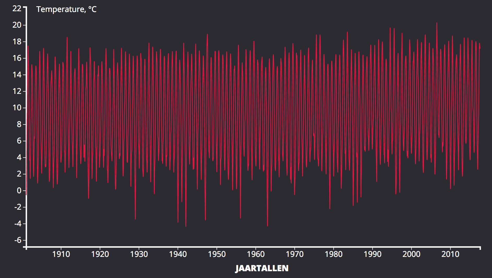

# ASSESMENET 1 - FRONT-END 3

## Index

* [Assesment](Assesment)
* [Workflow](Workflow)
* [Features](Features)
* [Sources](Sources)

## Assesment
Create a chart using a dataset with D3.js V4.

## Workflow
1. Checking which dataset I want to use.
2. Research which chart is best used for the data.
3. Look for a base source code to work on.
4. Implement the data so it is understandable.
5. Use css styling to make it more appealing.

## Sources

* [Simple bar graph in v4](https://bl.ocks.org/d3noob/bdf28027e0ce70bd132edc64f1dd7ea4)
* [Bar Chart with Negative Values](https://bl.ocks.org/mbostock/2368837)
* [Difference Chart](https://bl.ocks.org/mbostock/3894205)
* [Error Rect Attribute Expected Length NaN](https://stackoverflow.com/questions/40746319/error-rect-attribute-width-expected-length-nan-and-text-attribute-dx)
* [Axes-d3-Axis](https://github.com/d3/d3/blob/master/API.md#axes-d3-axis)
* [Keith P Blog - upgrading d3 from v3 to v4](https://keithpblog.org/post/upgrading-d3-from-v3-to-v4/)
* [Dashing D3js - SVG text element](https://www.dashingd3js.com/svg-text-element)
* [Dashing D3js - SVG group element and d3js](https://www.dashingd3js.com/svg-group-element-and-d3js)

## Process

I first started with a different chart, by due time issues and my understanding of D3js I used something different.
V3 and V4 really have some big differences it took me some time to figure these out.

## Review

I'm especially proud about the fact that I figured a lot of things out in such a short time.
Although I'm sure I could've develiverd a better product if I had more time.

## License

Released under the GNU General Public License, version 3.
